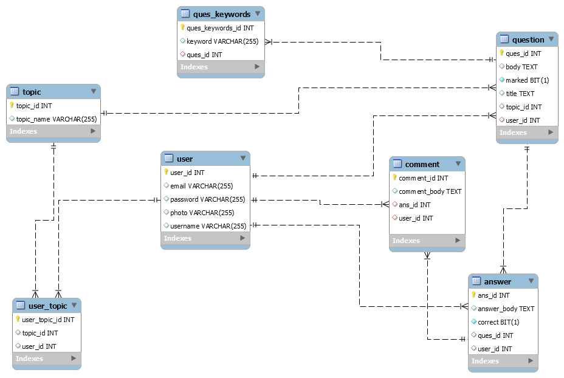

## Steps to run the project: 
<!-- OL -->
1. Clone the repository  
2.  Open MySQL and run query  *create database auproject;*
3.  Import Backend from Eclipse as Maven project
4.  Update application.properties file located in 'Backend/src/main/resources/' with your MySql credentials and run <i>DiscussionforumApplication.java</i> as Java application
5.  Open MySql again and paste the following queries:  
   ```
   insert into topic(topic_id, topic_name) values (1, 'badminton');  
   insert into topic(topic_id, topic_name) values (2, 'algorithm');  
   insert into topic(topic_id, topic_name) values (3, 'technology');  
   insert into topic(topic_id, topic_name) values (4, 'framework');  
   insert into topic(topic_id, topic_name) values (5, 'psychiatry');  
   insert into topic(topic_id, topic_name) values (6, 'chess');
   ```
6.   Go to Frontend, open terminal and run the following commands: 
   ```
      npm install
      ng serve --proxy-config=proxyconfig.json
   ```
7.   Visit <a href="http://localhost:4200/">http://localhost:4200/</a> in your browser </h2> <br>

#### ER DIAGRAM
 
